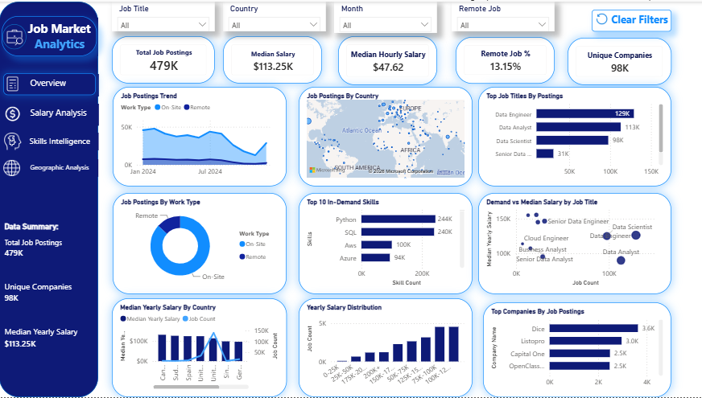

# 📊 Job Market Analytics — Power BI

What jobs are in demand? Which skills matter most? Where are the opportunities? And what does the salary landscape actually look like?

An end-to-end Power BI job market analytics project built to analyze real-world job posting data and answer practical questions faced by job seekers, analysts, recruiters, and career decision-makers.

The project transforms raw job-posting data into an interactive analytical experience covering job demand, compensation, skills, geography, work arrangements, companies, and market trends.

---

## 🚀 Project Overview

Finding a job is not only about applying to more positions.  
Job seekers constantly face questions such as:

* Which roles are actually in demand?
* What skills are employers requesting most often?
* Is learning a specific technology worth the time?
* Which roles combine high demand with strong compensation?
* Where are the strongest job markets?
* Which countries offer better salary opportunities?
* How common are remote opportunities?
* How much salary information is actually available in job postings?
* Which companies are hiring the most?

This project was designed to answer those questions through data-driven analysis rather than assumptions.

The dashboard combines job postings with information about:
* Job titles
* Salaries
* Countries and locations
* Companies
* Skills
* Work arrangements
* Posting dates
* Job schedules

The result is a multi-page Power BI dashboard that allows users to explore the labor market from both a high-level strategic perspective and a detailed job-market perspective.

---

## 🎯 Business Questions

The dashboard was built around five major analytical questions.

### 1. What is happening in the job market?
* Which job titles dominate demand?
* How does job demand change over time?
* Which companies appear most frequently?
* How common are remote positions?

### 2. What does the salary market look like?
* What is the median yearly salary?
* What is the median hourly salary?
* How are salaries distributed?
* Which roles have the highest median compensation?
* How does compensation differ across countries?
* How does compensation vary by work arrangement?

### 3. What skills are employers demanding?
* Which skills appear most frequently?
* Which skills are associated with specific job titles?
* How many skills are typically requested per job?
* Which skills appear in higher-paying postings?
* Which combinations of skills commonly appear together?

### 4. Where are the opportunities?
* Which countries have the largest number of postings?
* Which countries have higher median compensation?
* Where are remote opportunities concentrated?
* Which markets combine high demand with high salaries?

### 5. What does the actual job market look like?
The dashboard is designed to allow users to move beyond aggregate statistics and investigate individual job-market segments through interactive filtering.

---

## 📌 Dashboard Pages

### 01 — Executive Overview



The executive page provides a high-level view of the market.

**Key metrics**
* Total Job Postings
* Median Salary
* Median Hourly Salary
* Remote Job %
* Unique Companies
* Salary Data Coverage

**Main analysis**
* Job Postings Trend
* Job Postings by Country

*What does the overall job market look like?*

---

### 💰 02 — Salary Analysis


This page focuses on the economics of the job market.

**Key metrics**
* Median Yearly Salary
* 25th Percentile Salary
* 75th Percentile Salary
* Salary Data Coverage

**Main analysis**
* Yearly Salary Distribution
* Median Salary by Job Title
* Median Salary by Country
* Salary Trend Over Time
* Median Hourly Salary by Work Type

**Main question answered**  
*Which roles and markets offer stronger compensation?*

---

### 🧠 03 — Skills Intelligence


This page investigates the relationship between skills, demand, and compensation.

**Key metrics**
* Skill Requirements
* Most In-Demand Skill
* Highest-Paying Skill
* Average Skills per Job
* Jobs Requiring 3+ Skills

**Main analysis**
* Top In-Demand Skills
* Skill Demand by Job Title
* Demand vs. Median Salary by Job Title
* Skills with Highest Salary Premium
* Lowest-Paying Skills

**Main question answered**  
*What skills are employers actually asking for, and which skills are associated with stronger compensation?*


---

### 🌍 04 — Geographic Analysis


This page examines geographic differences in job demand and compensation.

**Key metrics**
* Top Country by Job Postings
* Top Country by Median Salary
* Total Countries

**Main analysis**
* Job Postings by Country
* Top Countries by Job Postings
* Demand vs. Median Salary by Country
* Countries with Highest Salary Premium

**Main question answered**  
*Where are the strongest opportunities, and how does compensation differ across markets?*

---

## 📊 Key Analytical Insights

Some of the most interesting patterns identified in the current dashboard include:

* **🔹 Demand is highly concentrated**  
  A relatively small number of job categories account for a substantial share of postings, making specialization and role selection important when evaluating career paths.

* **🔹 SQL and Python are among the strongest recurring skills**  
  The skills analysis shows SQL and Python appearing prominently across job postings, demonstrating the continued importance of combining data querying with programming/analytical capabilities.

* **🔹 Demand and compensation are not the same thing**  
  The dashboard makes this visible through Demand vs. Median Salary scatterplots.  
  A role can have:
  * high demand but moderate salary,
  * lower demand but very high salary,
  * or both high demand and high compensation.  
  This distinction is important for career planning.

* **🔹 Remote opportunities are only part of the market**  
  Remote roles represent a measurable but limited share of total postings. Geographic analysis shows that remote availability can vary substantially across markets.

* **🔹 Salary data is much less complete than job-posting data**  
  Only a portion of job postings contain usable salary information.  
  Therefore:
  * Salary statistics should not be interpreted as representative of every posting.
  * This is why the dashboard explicitly exposes Salary Data Coverage.

---

## 🗂️ Data Model

The project uses a relational/star-schema-style Power BI model.

### Fact Table

* **`job_postings_fact`**  
  Contains the main job-posting information, including:
  * Job ID
  * Company ID
  * Country
  * Location
  * Job title
  * Work arrangement
  * Schedule
  * Posting date
  * Salary fields

### Supporting Dimensions

* **`company_dim`**: Contains company-level information.
* **`skills_dim`**: Contains unique skills.
* **`skills_job_dim`**: Acts as the bridge between jobs and skills, allowing many-to-many skill analysis.
* **`schedule_dim`**: Contains job schedule information.
* **`Date`**: Dedicated date dimension used for time-based analysis.

---

## 🔗 Model Relationships

The core analytical structure follows:

```text
                    ┌───────────────┐
                    │ company_dim   │
                    └───────┬───────┘
                            │
                            │
┌─────────────┐      ┌──────▼──────────────┐      ┌───────────────┐
│  Date       │──────│  job_postings_fact  │──────│ schedule_dim  │
└─────────────┘      └─────────┬───────────┘      └───────────────┘
                               │
                               │
                       ┌───────▼────────┐
                       │ skills_job_dim │
                       └───────┬────────┘
                               │
                       ┌───────▼───────┐
                       │   skills_dim  │
                       └───────────────┘
```

---

## 🧮 Key DAX Measures

Examples of core measures used in the analysis include:

### Job Count

```
Job Count =
COUNTROWS(job_postings_fact)
```

### Median Yearly Salary

```
Median Yearly Salary =
MEDIAN(job_postings_fact[salary_year_avg])
```

### Median Yearly Salary — Excluding US

```
Median Yearly Salary (Excl. US) =
CALCULATE(
    MEDIAN(job_postings_fact[salary_year_avg]),
    job_postings_fact[job_country] <> "United States"
)
```

### Median Yearly Salary — US

```
Median Yearly Salary (US) =
CALCULATE(
    MEDIAN(job_postings_fact[salary_year_avg]),
    job_postings_fact[job_country] = "United States"
)
```

### Skill Count

```
Skills Count =
COUNTROWS(
    RELATEDTABLE(skills_job_dim)
)
```

Additional measures are used for:

- Salary percentiles
- Salary coverage
- Remote-job percentage
- Skill demand
- Salary premiums
- Country comparisons
- Time-based trends

---

## 🛠️ Tools & Technologies

| Technology | Purpose |
| --- | --- |
| **Power BI** | Dashboard development and data visualization |
| **DAX** | Measures, KPIs, calculations and analytical logic |
| **Power Query** | Data cleaning and transformation |
| **Data Modeling** | Relationships and dimensional analysis |
| **SQL / Data Preparation** | Data preparation and analytical thinking |
| **GitHub** | Project documentation and portfolio presentation |

---

## 📐 Analytical Methodology

The project focuses on **descriptive and diagnostic analytics**.

Rather than simply displaying totals, the dashboard compares:

**Demand**

against

**Compensation**

and

**Skills**

across

**Roles**

**Countries**

**Companies**

**Work arrangements**

and

**Time**

This allows users to move from:

> **What happened?**
to:

> **Where did it happen?**
and eventually:

> **What does this mean for a job seeker?**

---

## ⚠️ Data Quality & Interpretation Considerations

A professional dashboard should also make its limitations visible.

### Salary coverage

Salary information is only available for a subset of job postings. Salary-based conclusions must therefore be interpreted relative to the available salary observations.

### Sample size

Salary comparisons involving countries, skills, or roles with very few observations may be unstable.

### Median vs. average

Median salary is emphasized because salary distributions can contain extreme values and outliers.

### Correlation vs. causation

A higher salary associated with a skill does **not** automatically mean that the skill causes higher compensation.

### Geographic comparisons

Cost of living, taxes, labor-market conditions, currency differences, and seniority composition are not necessarily captured by the raw salary figure.

---

## 💡 Why This Project Matters

A traditional job board tells you:

> **"Here are the jobs."**

This project asks:

> **"What can we learn from all those jobs?"**

The objective is to transform job-posting data into something useful for people making career decisions.

For example:

> Should I focus on SQL or another skill?

> Should I target Data Analyst or Data Engineer roles?

> Should I prioritize remote opportunities?

> Which countries have meaningful demand?

> Is higher salary associated with higher demand?

> What skills repeatedly appear across high-value roles?

These are **analytical questions**, not just dashboard questions.

---

## 📈 Future Improvements

Potential next steps include:

- Dedicated interactive Job Explorer
- Experience-level classification
- Skill-pair analysis
- Minimum sample-size thresholds for salary-premium analysis
- Job seniority analysis
- Remote opportunity scoring
- Skill-to-salary benchmarking
- Advanced time-series forecasting
- Automated data refresh
- Drill-through pages for individual roles and companies

---

## 👨‍💻 Author

**Hamza Younes**

Data Analyst | Power BI | SQL | Python | Financial Analytics

This project is part of my continued development in **Data Analytics, Business Intelligence, and Financial Data Analysis**.

---

## ⭐ Project Goal

The goal of this project was not simply to build charts.

It was to demonstrate the complete analytical workflow:

```
Raw Job Data
     ↓
Data Cleaning & Transformation
     ↓
Data Modeling
     ↓
DAX Measures
     ↓
Interactive Visualization
     ↓
Business Questions
     ↓
Actionable Insights
```

> **Data becomes valuable when it helps someone make a better decision.**


